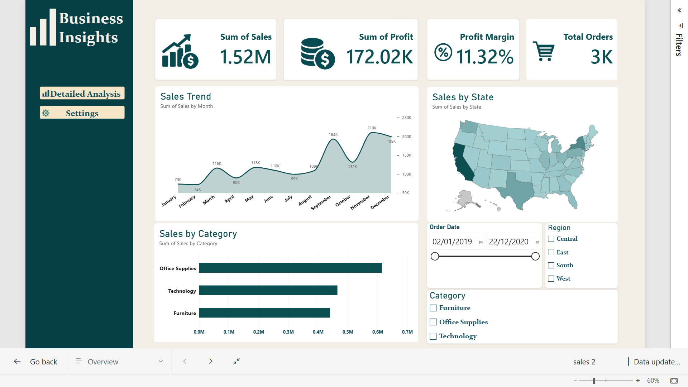
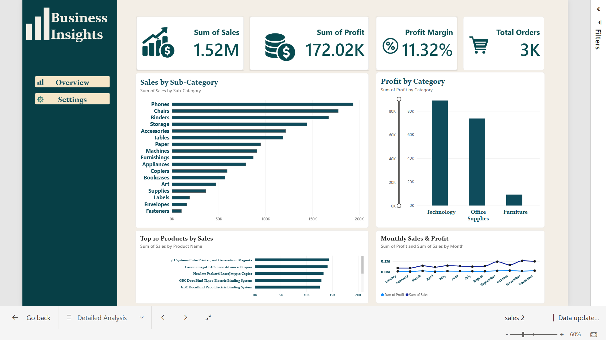
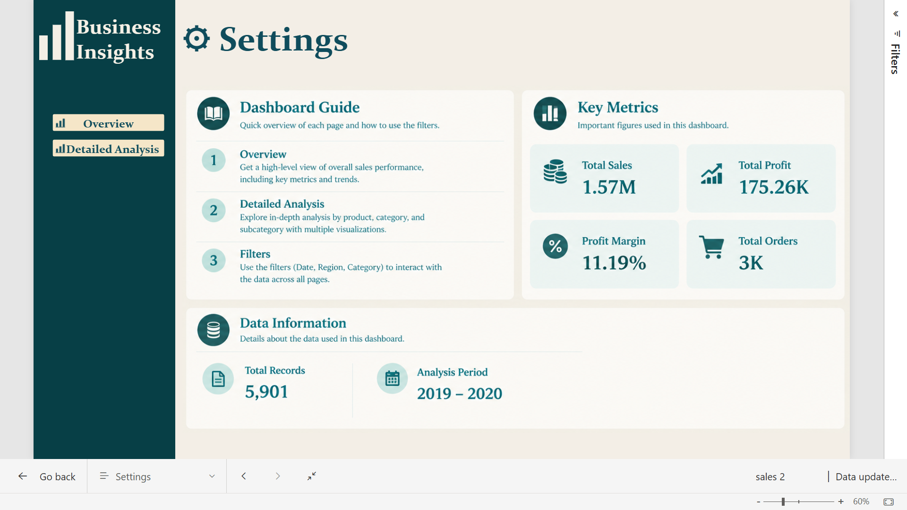

# Power BI Business Insights Dashboard

An interactive Power BI dashboard designed to analyze sales, profitability, orders, product performance, and regional trends.

## 📊 Project Overview

This project presents an interactive Business Insights Dashboard built in Microsoft Power BI.

The dashboard helps analyze business performance through KPIs, trends, category analysis, product performance, regional analysis, and interactive filters.

## 🎯 Project Objectives

- Analyze overall sales and profit performance
- Track profit margin and total orders
- Identify sales trends over time
- Compare sales across product categories
- Analyze state and regional performance
- Identify top-performing products
- Provide interactive business insights through filters

## 🛠️ Tools & Technologies

- Microsoft Power BI
- Power Query
- DAX
- Data Visualization
- Data Analysis

## 📄 Dashboard Pages

### 1. Sales Overview

The Overview page contains:

- Total Sales
- Total Profit
- Profit Margin
- Total Orders
- Sales Trend
- Sales by Category
- Sales by State
- Date Filter
- Region Filter
- Category Filter

### 2. Detailed Analysis

The Detailed Analysis page includes:

- Sales by Sub-Category
- Profit by Category
- Top 10 Products by Sales
- Monthly Sales & Profit Analysis

### 3. Settings

The Settings page provides:

- Dashboard Guide
- Key Metrics
- Data Information
- Project navigation

## 📈 Key Metrics

| Metric | Value |
|---|---:|
| Total Sales | 1.52M |
| Total Profit | 172.02K |
| Profit Margin | 11.32% |
| Total Orders | 3K |

## 💡 Key Features

- Interactive filters and slicers
- Cross-page navigation
- KPI cards
- Sales trend analysis
- Category and sub-category analysis
- Top 10 product analysis
- Regional and state-level analysis
- Interactive Power BI visuals

## 📸 Dashboard Preview

### Sales Overview

### Detailed Analysis

### Settings

**Created with Microsoft Power BI**
